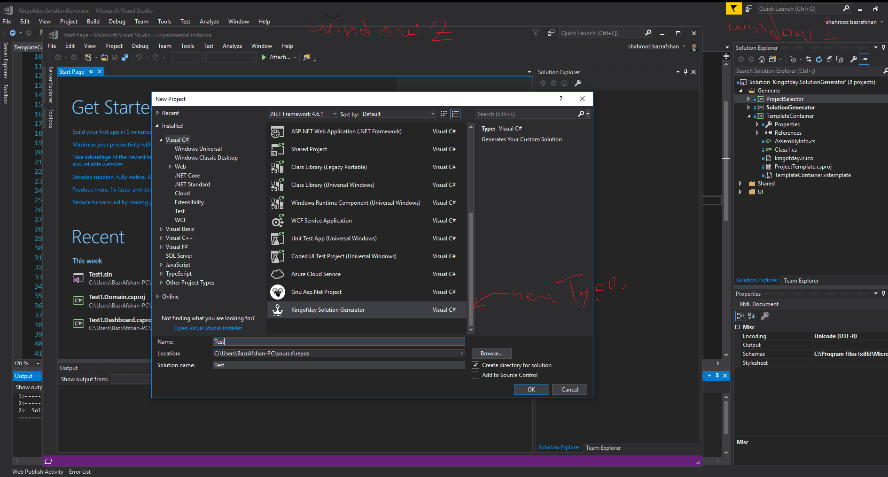

### Requirements

* Visual Studio 2017

### Simple Usage
```
1- add your projects to solution, except "Generate" folder projects, others not required.
2- add or edite "TemplateContainer -> TemplateContainer.vstemplate" file to match your projects you added and you needed.(you can figure it out hot to do this from examples)
3- close all of other visual studio windows
4- set project "ProjectSelector"  as start up project and run it(ctrl+F5)
5- after that an win form pop ups and you can select proejcts you want to be in your new solution.
6- set project "SolutionGenerator"  as start up project and run it.(ctrl+F5)
7- after that a new visual studio would be opened and you can see a new type of project with name "Kingofday Solution Generator".
```

### Advanced Usage
```
1- add your codes into current projects
2- close all of other visual studio windows
3- set project "ProjectSelector"  as start up project and run it(ctrl+F5)
4- after that an win form pop ups and you can select proejcts you want to be in your new solution.
5- set project "SolutionGenerator"  as start up project and run it.(ctrl+F5)
6- after that a new visual studio would be opened and you can see a new type of project with name "Kingofday Solution Generator".
```

### Some Points

* in "TemplateContainer -> TemplateContainer.vstemplate" file, "$safeprojectname$" means what you type for your new soultion name.

### schema


